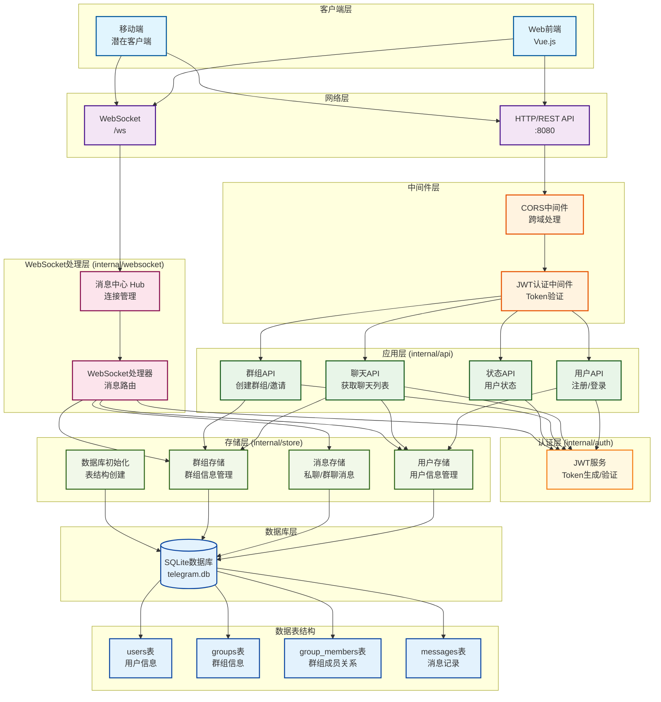

# Learning Telegram - 即时通讯学习项目

[](https://github.com/husterxun/learning-telegram/actions/workflows/ci-cd.yml)
[](https://github.com/husterxun/learning-telegram/actions/workflows/pr-preview.yml)

这是一个基于Go语言和Vue.js的即时通讯应用学习项目，模仿Telegram的核心功能实现。

## 🚀 CI/CD 自动化

本项目集成了完整的CI/CD流水线，包括：

### 主要工作流
- **代码质量检查**: Go代码格式化、静态分析，前端代码检查
- **安全扫描**: 使用Trivy进行漏洞扫描
- **自动构建**: 每次推送到主分支时自动构建Docker镜像
- **自动发布**: 构建成功后自动推送到Docker Hub

### Pull Request工作流
- **预览构建**: PR提交时进行构建测试，确保代码质量
- **无推送构建**: 仅验证构建过程，不推送到生产环境

### 触发条件
- **主分支推送**: 触发完整的CI/CD流程
- **Pull Request**: 触发预览构建和质量检查

### 🔧 CI/CD 设置

如需配置CI/CD流程，请参考 [CI/CD设置指南](docs/CICD_SETUP.md)。

## 🏗️ 项目架构



## 📋 架构说明

### 核心架构层次

1. **程序入口层**
   - `cmd/server/main.go`: 程序启动点，路由配置，服务器初始化

2. **网络传输层**
   - **HTTP REST API**: 端口8080，处理用户注册、登录、群组管理等请求
   - **WebSocket**: `/ws`端点，处理实时消息传输

3. **中间件层**
   - **CORS中间件**: 处理跨域请求
   - **JWT认证中间件**: 验证用户身份，保护需要认证的API

4. **API处理层** (`internal/api/`)
   - **用户管理**: 注册、登录功能
   - **聊天管理**: 获取聊天列表
   - **群组管理**: 创建群组、邀请成员
   - **状态管理**: 用户在线状态

5. **WebSocket处理层** (`internal/websocket/`)
   - **Hub**: 管理所有WebSocket连接，维护用户-连接映射
   - **Handler**: 处理各类消息（私聊、群聊、历史记录、输入状态）

6. **认证层** (`internal/auth/`)
   - **JWT服务**: Token生成、验证、Claims管理

7. **存储层** (`internal/store/`)
   - **用户存储**: 用户信息管理
   - **消息存储**: 私聊和群聊消息持久化
   - **群组存储**: 群组信息和成员关系管理
   - **数据库初始化**: 创建和管理表结构

8. **数据库层**
   - **SQLite数据库**: 轻量级关系型数据库
   - **四个核心表**: users、groups、group_members、messages

## 📁 项目结构

```
learning-telegram/
├── backend/                     # Go后端服务
│   ├── cmd/
│   │   └── server/
│   │       └── main.go          # 程序入口
│   ├── internal/
│   │   ├── api/                 # API处理器
│   │   ├── auth/                # 认证逻辑
│   │   ├── store/               # 数据库操作
│   │   └── websocket/           # WebSocket处理
│   ├── go.mod                   # Go模块定义
│   └── telegram.db              # SQLite数据库文件
├── frontend/                    # Vue.js前端
│   └── ...
├── deploy/                      # 部署相关文件
│   ├── deploy.sh                # 部署脚本
│   ├── nginx.conf               # Nginx开发配置
│   └── ...
└── README.md                    # 就是你正在看的文件
```

## 🔄 核心特性

- **实时通信**: WebSocket支持即时消息传输
- **多端同步**: 同一用户多个连接间的消息同步
- **群组聊天**: 支持群组创建、成员管理和群组消息
- **消息持久化**: 所有消息保存到数据库，支持历史记录查询
- **用户状态**: 实时用户在线状态管理
- **输入状态**: 支持"正在输入"功能

## 🛡️ 安全机制

- JWT Token认证保护所有需要认证的API
- bcrypt密码哈希存储
- WebSocket连接也需要Token验证
- 群组权限验证（只有群成员才能访问群消息）

## 🚀 容器化运行 (推荐)

本项目已在 Docker Hub 上提供了预构建好的镜像，您只需要安装 [Docker](https://www.docker.com/) 和 [Docker Compose](https://docs.docker.com/compose/install/) 即可一键启动整个应用。

### 1. 启动应用

在项目根目录下，执行以下一条命令即可。Docker Compose 将会自动从 Docker Hub 拉取预构建的镜像，并在后台启动所有服务。

```bash
docker-compose up -d
```

服务启动后，您可以通过以下地址访问：
- **前端应用**: `http://localhost:8888`
- **后端API**: `http://localhost:8080` (通常由前端访问，无需直接操作)

### 2. 查看日志

如果需要查看服务运行的实时日志，可以执行：

```bash
docker-compose logs -f
```

### 3. 停止应用

```bash
docker-compose down
```

### 镜像地址

本项目使用的预构建镜像托管在 Docker Hub，您可以在以下地址找到它们：

- **后端**: [`husterxun/telegram-backend`](https://hub.docker.com/r/husterxun/telegram-backend)
- **前端**: [`husterxun/telegram-frontend`](https://hub.docker.com/r/husterxun/telegram-frontend)
- **构建器** (供开发者使用): [`husterxun/telegram-builder`](https://hub.docker.com/r/husterxun/telegram-builder)

## 🛠️ 本地开发启动 (不使用Docker)

### 后端启动

```bash
# 1. 进入后端目录
cd backend

# 2. 安装依赖
go mod tidy

# 3. 启动服务器
go run cmd/server/main.go
```

### 前端启动

```bash
# 1. 进入前端目录
cd frontend

# 2. 安装依赖
npm install

# 3. 启动开发服务器
npm run dev
```

## 📡 API接口

### 认证相关
- `POST /api/register` - 用户注册
- `POST /api/login` - 用户登录

### 聊天相关
- `GET /api/me/chats` - 获取聊天列表（需要认证）

### 群组相关
- `POST /api/groups/create` - 创建群组（需要认证）
- `POST /api/groups/invite` - 邀请用户加入群组（需要认证）

### 状态相关
- `GET /api/status/user` - 获取用户状态（需要认证）

### WebSocket消息类型
- `send_message` / `private` - 发送私聊消息
- `send_group_message` / `group` - 发送群组消息
- `history` - 获取私聊历史记录
- `history_group` - 获取群组历史记录
- `typing` - 发送输入状态

## 📊 数据库设计

### users表
- `id` - 用户ID（主键）
- `username` - 用户名（唯一）
- `password_hash` - 密码哈希
- `created_at` - 创建时间

### groups表
- `id` - 群组ID（主键）
- `name` - 群组名称
- `creator_id` - 创建者ID
- `created_at` - 创建时间

### group_members表
- `group_id` - 群组ID（外键）
- `user_id` - 用户ID（外键）
- `joined_at` - 加入时间

### messages表
- `id` - 消息ID（主键）
- `sender_id` - 发送者ID
- `receiver_id` - 接收者ID（私聊）
- `group_id` - 群组ID（群聊）
- `content` - 消息内容
- `created_at` - 创建时间

## 🛠️ 技术栈

### 后端
- **Go**: 主要编程语言
- **Gorilla WebSocket**: WebSocket支持
- **JWT**: 身份认证
- **SQLite**: 数据库
- **bcrypt**: 密码加密

### 前端
- **Vue.js**: 前端框架
- **TypeScript**: 类型安全
- **Vite**: 构建工具

## 📝 学习目标

这个项目旨在学习和实践：

1. **Go语言Web开发**: HTTP服务器、路由、中间件
2. **WebSocket实时通信**: 连接管理、消息广播
3. **JWT认证机制**: Token生成、验证、中间件
4. **数据库设计**: 关系型数据库设计、SQL操作
5. **前后端分离**: RESTful API设计、跨域处理
6. **即时通讯架构**: 消息系统、在线状态管理

## 🔧 开发计划

- [x] 用户注册登录
- [x] JWT认证
- [x] 私聊功能
- [x] 群组聊天
- [x] 历史记录
- [x] 在线状态
- [x] 输入状态
- [ ] 文件传输
- [ ] 消息撤回
- [ ] 消息搜索
- [ ] 用户头像
- [ ] 群组管理员功能

## 📄 许可证

本项目仅用于学习目的，请勿用于商业用途。 