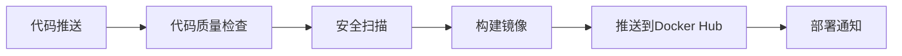
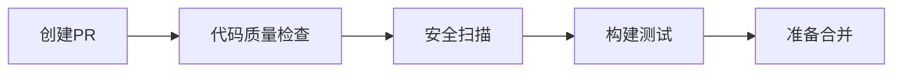

# CI/CD 设置指南

本文档将指导您如何为 Learning Telegram 项目设置完整的CI/CD流程。

## 📋 前置条件

1. **GitHub仓库**: 项目需要托管在GitHub上
2. **Docker Hub账户**: 用于存储构建的镜像
3. **Docker Hub访问令牌**: 用于CI/CD自动推送镜像

## 🔑 配置GitHub Secrets

### 1. 创建Docker Hub访问令牌

1. 登录到 [Docker Hub](https://hub.docker.com/)
2. 点击右上角的用户头像 → **Account Settings**
3. 选择 **Security** 标签页
4. 点击 **New Access Token**
5. 输入令牌名称（例如：`github-actions`）
6. 选择权限：**Read, Write, Delete**
7. 点击 **Generate** 并复制生成的令牌

### 2. 在GitHub中添加Secrets

1. 进入您的GitHub仓库
2. 点击 **Settings** 标签页
3. 在左侧菜单中选择 **Secrets and variables** → **Actions**
4. 点击 **New repository secret**
5. 添加以下Secret：

| Secret名称 | 值 | 说明 |
|-----------|-----|------|
| `DOCKER_HUB_TOKEN` | 您的Docker Hub访问令牌 | 用于CI/CD推送镜像到Docker Hub |

### 3. 验证配置

添加完Secret后，您可以：
1. 推送代码到主分支，触发CI/CD流程
2. 在 **Actions** 标签页查看工作流执行状态
3. 检查Docker Hub中是否有新的镜像被推送

## 🚀 CI/CD工作流程

### 主分支推送流程



### Pull Request流程



## 🔧 自定义配置

### 修改Docker Hub用户名

如果您的Docker Hub用户名不是 `husterxun`，需要修改以下文件：

1. **`.github/workflows/ci-cd.yml`**:
   ```yaml
   env:
     DOCKER_USERNAME: your-username  # 修改为您的用户名
   ```

2. **`.github/workflows/pr-preview.yml`**:
   ```yaml
   env:
     DOCKER_USERNAME: your-username  # 修改为您的用户名
   ```

3. **所有镜像名称**:
   ```yaml
   BACKEND_IMAGE: your-username/telegram-backend
   FRONTEND_IMAGE: your-username/telegram-frontend
   BUILDER_IMAGE: your-username/telegram-builder
   ```

### 添加更多检查

您可以在 `code-quality` 任务中添加更多检查：

```yaml
- name: Run tests
  run: |
    cd backend
    go test -v ./...

- name: Frontend tests
  run: |
    cd frontend
    npm test
```

## 🎯 最佳实践

1. **分支保护**: 在GitHub中设置分支保护规则，要求CI/CD通过才能合并
2. **状态检查**: 启用必需的状态检查，确保代码质量
3. **自动化部署**: 可以扩展工作流，添加自动部署到生产环境的步骤
4. **通知集成**: 集成Slack、微信等通知渠道，及时了解构建状态

## 🐛 故障排除

### 常见问题

1. **Docker Hub登录失败**
   - 检查 `DOCKER_HUB_TOKEN` Secret是否正确设置
   - 确认访问令牌权限包含 Write 权限

2. **镜像构建失败**
   - 检查 `Dockerfile` 语法
   - 确认依赖的基础镜像存在

3. **工作流不触发**
   - 确认推送到的是 `main` 或 `master` 分支
   - 检查 `.github/workflows/` 目录下的YAML文件语法

### 调试技巧

1. 在GitHub Actions中查看详细日志
2. 使用 `act` 工具在本地测试GitHub Actions
3. 逐步注释工作流步骤，定位问题所在

## 📚 扩展阅读

- [GitHub Actions 官方文档](https://docs.github.com/en/actions)
- [Docker Hub 自动构建](https://docs.docker.com/docker-hub/builds/)
- [安全扫描最佳实践](https://github.com/aquasecurity/trivy-action) 